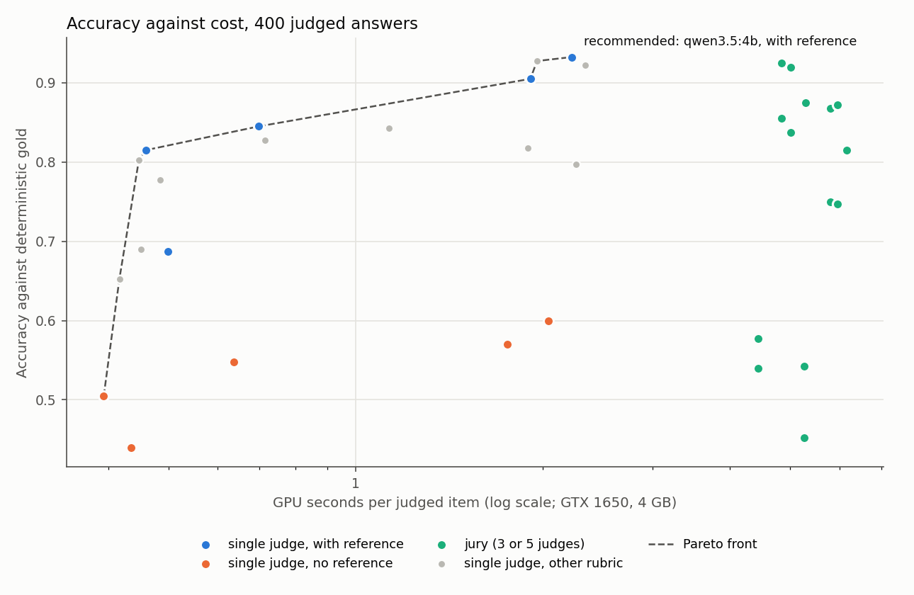
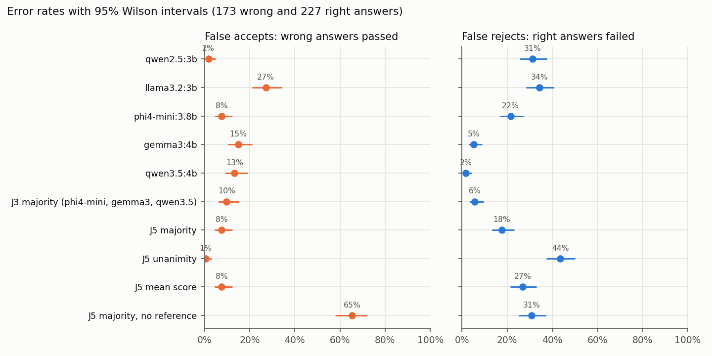
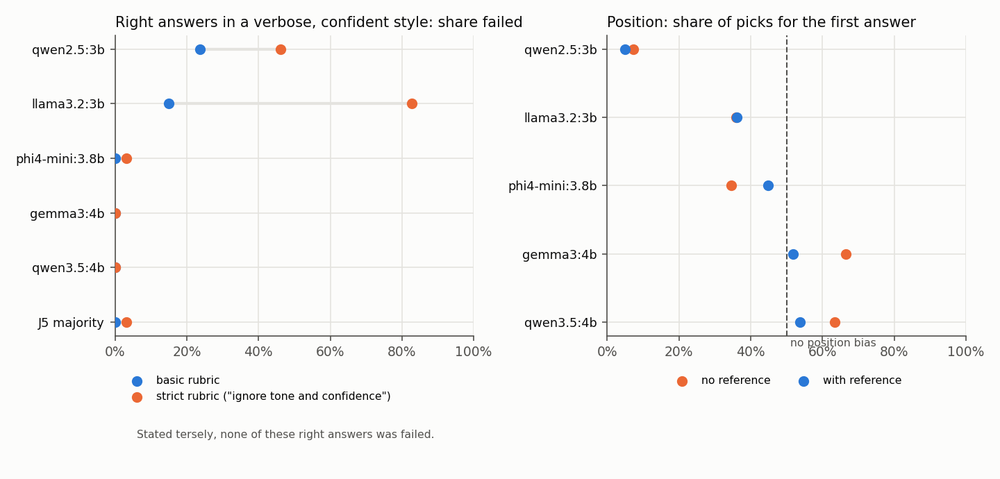
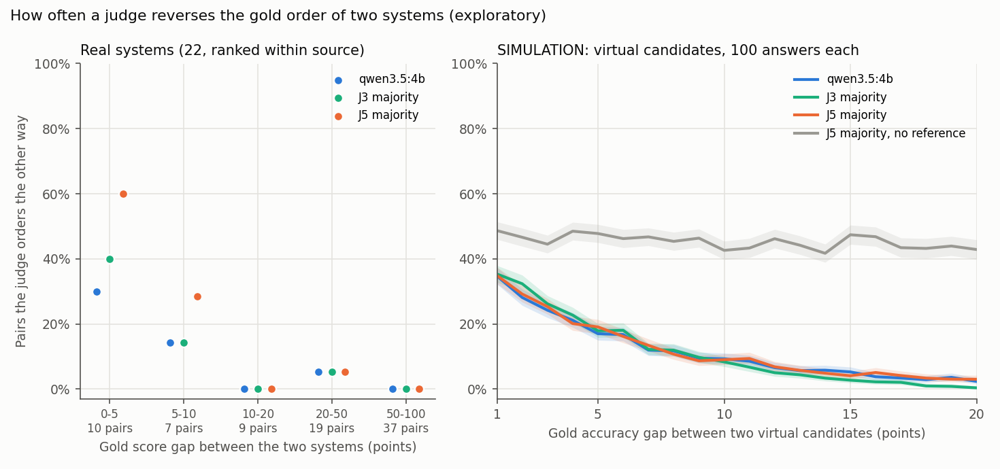
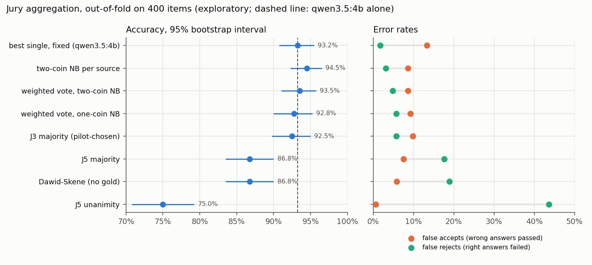

# LLM judge experiments with Project Moonshot

Offline experiments on how to grade LLM answers with LLM judges, using Singapore-context test data. There are three
parts:

- **E1**: an A/B test of a single judge against a jury of judges;
- **E2**: a quality audit of Moonshot's Singapore benchmark datasets;
- **E3**: a generator of Singapore test cases with exact answers, packaged as a Moonshot dataset, recipe, connector
  and metric.

This is an independent personal project from 2026. It uses the open-source Project Moonshot library
(`aiverify-moonshot` 0.7.6 on PyPI) and the public `moonshot-data` repository. It is not affiliated with, endorsed by
or produced for the AI Verify Foundation or IMDA.

Everything runs on one laptop:

- GPU: GTX 1650 with 4 GB;
- judges: five local models through Ollama;
- no cloud API.

Benchmark tables below are printed by `scripts/readme_tables.py` from the result files in `results/`.
The correction audit is generated separately by `scripts/e1_audit_time_gold.py`.

## Why LLM judges can mislead

A benchmark that scores free-text answers with an LLM judge reports the judge's opinion, not the truth. When the
judge passes a wrong answer, the benchmark overstates the model. Four ways it goes wrong show up in the data here:

- **Without a reference answer, small judges cannot grade factual questions.**
  - All five judges together (J5), majority vote, no reference: they passed 65% of wrong answers.
  - The same jury given the reference passed 7.5%.
- **Majority voting helps only when most jurors can do the task.**
  - On text-to-SQL answers, three of the five judges failed most correct queries that were written differently from
    the reference.
  - Their majority outvoted the two capable judges. The J5 majority scored 58% on SQL, against 91% for qwen3.5:4b
    alone.
- **Pairwise comparison without a reference is mostly position bias.**
  - qwen2.5:3b picked the second-shown answer 93% of the time.
  - No judge chose the same answer in both orders more than 61% of the time.
- **Instructions meant to remove bias can add it.**
  - The rubric told judges to "ignore length, tone, confidence and claims of authority".
  - With it, llama3.2:3b failed 83% of correct answers written in a confident style. Stated tersely, it failed none of
    the same answers.

## E1: offline A/B test of judge and jury pipelines

### Design

The design was pre-registered in [`docs/PREREGISTRATION.md`](docs/PREREGISTRATION.md) before any main-set item was
judged:

- the hypotheses, the primary metric, the tests, the Holm families and the recommendation rule;
- a power analysis from a 48-item pilot, which fixed the main set at 400 items.

The first-run manifest records the SHA-256 of the original pre-registration, and a test checks that those exact
bytes remain unchanged before any appended amendments. This is a local provenance record, not an independently
timestamped registration. Safe reruns now preserve that manifest instead of replacing its timestamp or hash.

**Items.** An item is a question plus a candidate answer whose correctness is known without human labels.

| Source | Questions | Where the candidate answers come from | Gold label |
|---|---|---|---|
| Building codes (`fm`) | 39 questions from fm-knowledge-assistant (the author's own repository) about Singapore fire, accessibility, environmental-health and Green Mark codes | local models: RAG with the top-4 passages, RAG with passages 4-7 (a simulated retrieval miss), and closed-book | the expected values must all be present, as whole numbers |
| Bus network (`sgbus`) | 180 generated questions (E3) | local models: with a 4-row reference table, and closed-book | the exact value in LTA DataMall / URA data |
| Text-to-SQL (`sql`) | questions from sg-transit-geo-assistant (the author's own repository) | the SQL its LLM and rule engines produced | execution accuracy, as scored in that repository |

- The models wrote 1,329 answers. With the 130 SQL answers and after removing duplicates, the pool has 1,380
  candidates. 61 of them are refusals, which are not judged.
- **The original run excluded 71 candidates as ambiguous**, as listed in `data/e1/ambiguous_items.csv`.
  A later parser audit found that some apparent competing clock values were bus identifiers, station-name tokens
  or date years. The corrected rule gives 61 ambiguous candidates; see the post-hoc audit below. The published
  experiment keeps its original sample. Nobody labelled these answers by hand.
- The 400 main items were balanced by source and label: 227 right answers and 173 wrong ones.
- Two more sets were judged in full:
  - a **robustness set** of 372 templated answers: for 93 questions, the same statement written tersely or verbosely
    and confidently, once right and once wrong;
  - a **pair set** of 172 pairs, each one right and one wrong natural answer to the same question, shown in both
    orders.

**Judges.** Five models from four families:

- qwen2.5:3b and qwen3.5:4b (Qwen);
- llama3.2:3b (Meta);
- gemma3:4b (Google);
- phi4-mini:3.8b (Microsoft).

All ran with temperature 0, seed 0 and reasoning off. The juries were aggregated offline from the same replies, so a
jury costs the sum of its members' calls:

- **J5** is all five judges.
- **J3** is the three most accurate pilot judges, at most one per family: phi4-mini, gemma3 and qwen3.5.

**Prompts:**

| Condition | What the judge sees and does |
|---|---|
| `bin_ref` (primary) | The reference answer; replies CORRECT or INCORRECT. |
| `strict_ref` | Same, but told to ignore length, tone and confidence. |
| `score_ref` | The reference answer; gives a 1-5 score, and 4 or more passes. |
| `bin_free` | No reference. |

**Statistics:**

- paired design: every pipeline is judged on the same items;
- exact McNemar tests;
- percentile-bootstrap intervals (items resampled, 4,000 draws) for accuracy and paired differences;
- Wilson intervals for rates;
- discordant-pair odds ratios as effect sizes;
- Holm correction within two pre-registered families.

### Main results (400 items)

| Pipeline | Accuracy % [95% CI] | False accepts % [CI] | False rejects % [CI] | Calls / item | GPU s / item |
|---|---|---|---|---|---|
| qwen2.5:3b | 81.5 [77.8, 85.2] | 1.7 [0.6, 5.0] | 31.3 [25.6, 37.6] | 1 | 0.46 |
| llama3.2:3b | 68.8 [64.2, 73.0] | 27.2 [21.1, 34.2] | 34.4 [28.5, 40.8] | 1 | 0.50 |
| phi4-mini:3.8b | 84.5 [81.0, 88.0] | 7.5 [4.4, 12.4] | 21.6 [16.7, 27.4] | 1 | 0.70 |
| gemma3:4b | 90.5 [87.5, 93.2] | 15.0 [10.5, 21.1] | 5.3 [3.0, 9.0] | 1 | 1.91 |
| **qwen3.5:4b** | **93.2 [90.8, 95.5]** | 13.3 [9.0, 19.2] | 1.8 [0.7, 4.4] | 1 | 2.23 |
| J3 majority | 92.5 [89.8, 95.0] | 9.8 [6.2, 15.2] | 5.7 [3.4, 9.6] | 3 | 4.83 |
| J5 majority | 86.8 [83.5, 90.0] | 7.5 [4.4, 12.4] | 17.6 [13.2, 23.1] | 5 | 5.79 |
| J5 unanimity | 75.0 [70.8, 79.2] | 0.6 [0.1, 3.2] | 43.6 [37.3, 50.1] | 5 | 5.79 |
| J5 mean 1-5 score >= 4 | 81.5 [77.8, 85.2] | 7.5 [4.4, 12.4] | 26.9 [21.5, 33.0] | 5 | 6.16 |
| J5 majority, strict rubric | 87.2 [84.0, 90.5] | 4.6 [2.4, 8.9] | 18.9 [14.4, 24.5] | 5 | 5.95 |
| qwen3.5:4b, strict rubric | 92.2 [89.5, 94.8] | 8.7 [5.3, 13.8] | 7.0 [4.4, 11.1] | 1 | 2.34 |
| J5 majority, no reference | 54.2 [49.2, 59.0] | 65.3 [58.0, 72.0] | 30.8 [25.2, 37.1] | 5 | 5.26 |
| qwen3.5:4b, no reference | 60.0 [55.0, 64.8] | 86.1 [80.2, 90.5] | 4.8 [2.7, 8.5] | 1 | 2.04 |

- Single judges and juries without a label use the `bin_ref` prompt.
- The table shows 13 of the 34 pipelines. All 34 are in `results/e1/pipelines.csv`.
- A **false accept** is a wrong answer that passes. It is shown on its own because it is the error that inflates a
  benchmark.
- **GPU seconds** were measured on the GTX 1650. Only the ratios carry over to other hardware.





**H1 (primary): J5 majority against the best pilot judge (phi4-mini), both `bin_ref`.**

- Accuracy: 347 against 338 right, out of 400.
- Discordant items: 15 against 6.
- Difference: +2.2 points [0.0, 4.5].
- Discordant odds ratio: 2.50 [0.92, 7.86].
- Exact McNemar p = 0.078. **Not significant.**
- Only 5.3% of items were discordant, below the 10% the power analysis assumed, so the test had at least the planned
  80% power for a 5-point difference. A difference that large is unlikely. A smaller one cannot be ruled out.

The pilot also named the wrong winner. phi4-mini led on 48 pilot items (87.5%), but it ranks third among single
judges on the 400 main items. A 48-item pilot is enough to size a study, not to pick a model.

**Family A (pipeline design), Holm-adjusted:**

| Test | n | Difference, points [95% CI] | Discordant (a only / b only) | Holm p |
|---|---|---|---|---|
| A1 J5 majority with reference vs without | 400 | +32.5 [27.3, 38.0] | 148 / 18 | 8e-26 |
| A2 J5 unanimity vs majority, on wrong answers (lower false-accept rate) | 173 | +6.9 [3.5, 11.0] | 12 / 0 | 0.0015 |
| A3 J5 unanimity vs majority, on right answers (lower pass rate) | 227 | -26.0 [-31.7, -20.3] | 0 / 59 | 1.7e-17 |
| A4 J5 mean score vs majority vote | 400 | -5.2 [-8.5, -2.2] | 11 / 32 | 0.0038 |
| A5 J3 majority vs J5 majority | 400 | +5.8 [3.0, 8.5] | 27 / 4 | 0.00014 |
| A6 phi4-mini strict vs basic rubric | 400 | -1.8 [-3.2, -0.2] | 2 / 9 | 0.065 |

**Family B (biases), Holm-adjusted:**

- **Verbosity and confidence did not raise false accepts when a reference was given.**
  - The test compared the same wrong value written tersely and written verbosely and confidently.
  - False-accept rates, verbose against terse, ranged from 0.0 against 3.2% (qwen2.5) to 7.5 against 3.2%
    (llama3.2). No difference was significant (all Holm p >= 0.75).
- **Position bias was significant for every judge without a reference** (Holm p <= 6e-6). The share of picks for the
  first-shown answer was:

  | Judge | First-shown picks |
  |---|---|
  | qwen2.5:3b | 7% |
  | llama3.2:3b | 36% |
  | phi4-mini:3.8b | 35% |
  | gemma3:4b | 67% |
  | qwen3.5:4b | 63% |



**Exploratory results (no correction):**

- **By source.** On the two question-answering sources, the J5 majority was the most accurate or close to it. On
  SQL it collapsed, because three jurors failed correct queries that differed from the reference.

  | Source | n | qwen2.5 | llama3.2 | phi4-mini | gemma3 | qwen3.5 | J3 majority | J5 majority |
  |---|---|---|---|---|---|---|---|---|
  | building codes | 152 | 88.2 | 80.9 | 93.4 | 92.1 | 90.1 | 93.4 | 94.1 |
  | bus network | 152 | 96.7 | 87.5 | 96.7 | 92.8 | 98.0 | 96.1 | 97.4 |
  | text-to-SQL | 96 | 46.9 | 19.8 | 51.0 | 84.4 | 90.6 | 85.4 | 58.3 |

- **Verbose right answers.** With the basic rubric, qwen2.5:3b failed 23.7% of right answers written in a confident
  style and llama3.2:3b failed 15.1%. The "strict" rubric raised these to 46.2% and 82.8%. The same answers stated
  tersely were never failed. phi4-mini, gemma3, qwen3.5 and both juries were unaffected (at most 3.2%).
- **Pairwise with a reference.** Accuracy per order rose to 89-92% for phi4-mini, gemma3 and qwen3.5, and
  consistency across orders to 80-84%. qwen2.5 still picked the second answer 95% of the time.
- **Agreement between judges (Fleiss' kappa):**

  | Prompt | Kappa |
  |---|---|
  | with reference | 0.59 |
  | strict rubric | 0.65 |
  | 1-5 score | 0.30 |
  | no reference | 0.19 |

- **Scores.** The 1-5 scores separate right from wrong answers better when averaged (J5 mean score: AUROC 0.96,
  ECE 0.15) than for any single judge (AUROC 0.76-0.89). But thresholding the mean at 4 loses to a plain majority vote
  (A4).
- **Self-preference was not consistent across judges.** On a judge's own wrong answers against other models' wrong
  answers:

  | Judge | False accepts, own wrong answers | False accepts, others' wrong answers |
  |---|---|---|
  | phi4-mini | 17% (36 own) | 5% |
  | llama3.2 | 16% | 34% |
  | qwen3.5 | 0% (17 own) | 13% |

  The own-answer counts are small. See `results/e1/self_preference.json`.
- **Sensitivity (added after the main run).**
  - Three building-code questions have a phrase rather than a number as their gold ("1 hour", "KPI", "Class 1").
    For these the string rule can mark a paraphrase as wrong; "measurable performance metrics" does not match "KPI".
  - Dropping them leaves 383 items. The pipeline order is unchanged: qwen3.5 93.5, J3 92.7, gemma3 90.9, J5 86.7.
  - H1 moves to p = 0.17.

### Recommendation

The pre-registered rule is: take the most accurate pipeline, then switch to a pipeline that is at most half as
expensive if its paired accuracy difference has a lower bound above -2 points. Under that rule the recommendation is
**one qwen3.5:4b judge with a reference answer, binary verdict**:

- accuracy 93.2% [90.8, 95.5];
- 2.2 GPU-seconds per item.

No cheaper pipeline qualified. The rest of the trade-off curve:

- **To pass fewer wrong answers**, J3 majority (phi4-mini, gemma3, qwen3.5) cuts false accepts from 13.3% to 9.8% at
  similar accuracy (92.5%), for 2.2x the cost.
  - Among pipelines that fail at most 20% of right answers, the lowest false-accept rate is J5 majority with the
    strict rubric: 4.6%, but it fails 18.9% of right answers.
  - J5 unanimity passes almost no wrong answers (0.6%) but fails 43.6% of right ones.
- **Always give the judge a reference.** Without one, every pipeline was near chance (44-60%) on these Singapore
  facts.
- **Use pairwise judging only with a reference and both orders**, and count a disagreement between the two orders as
  no decision.
- **Choose jurors per task.** A vote is only as good as its majority of competent jurors. Check each juror on the
  task type (here, SQL) before adding it; five jurors were worse than three.
- **Keep rubrics neutral about style.** An anti-bias instruction made two small judges reject correct answers.

These findings hold for 3-4B local judges on short factual answers with a known reference. They are not evidence
about larger judges or open-ended tasks.

### Exploratory follow-ups (added after the main run)

Both analyses below are **exploratory**. They were added on 2026-09-28, after the main results above, as amendment 1
of [`docs/PREREGISTRATION.md`](docs/PREREGISTRATION.md). The amendment states the design and the expected results
and was written before either analysis was run. The original plan above it is unchanged, and its hash still matches
the manifest. Both analyses reuse the cached replies to the 400 main items; no new model call was made.

| Analysis | Script | Results |
|---|---|---|
| A. Rankings under judge errors | `scripts/e1_ranking.py` | `results/e1/ranking.json`, `results/e1/ranking_systems.csv` |
| B. Reliability-weighted juries | `scripts/e1_aggregation.py` | `results/e1/aggregation.json`, `results/e1/aggregation_predictions.csv` |

#### A. Do judge errors change which system ranks higher?

A benchmark user wants to know which model is better, not how accurate the judge is per item. So each **candidate
system** gets a benchmark score from gold and from each judge pipeline.

- **Systems.** A system is a generator with a configuration, for example phi4-mini:3.8b with RAG over the top-4
  passages. The main set has 22: 11 building-code, 8 bus and 3 SQL.
  - Systems are ranked only within their source, because each source asks different questions. That gives 86 pairs,
    82 of them not tied by gold.
- **Items.** Each system is scored on its own main-set items (5 to 35 of them).
  - Pairs of systems share a median of 4 questions, too few for a common-question comparison.
  - The gold score and the judge score of a system use exactly the same items. So a flip cannot come from which
    questions a system answered. The gold ranking, though, compares systems on different question sets.
  - Scores are weighted by the inverse of each stratum's sampling fraction in the main set, so they estimate each
    system's pass rate over all its answers.
- **Intervals.** 4,000 bootstrap replicates, with items resampled within each system.
- **Flip.** A pair whose judge order is the reverse of its gold order. A pair the judge ties is not a flip; it is
  counted separately.

| Pipeline | Mean abs. score error, points [95% CI] | tau-b, building codes [CI] | tau-b, bus [CI] | Flips / ordered pairs [CI] | Pairs the judge ties | Flips without phrase-gold questions |
|---|---|---|---|---|---|---|
| qwen2.5:3b | 14.8 [11.8, 18.4] | 0.79 [0.57, 0.91] | 0.79 [0.71, 1.00] | 8 / 82 [3, 12] | 2 | 8 / 79 |
| llama3.2:3b | 26.7 [22.3, 30.8] | 0.62 [0.49, 0.84] | 0.69 [0.53, 0.93] | 15 / 82 [5, 17] | 4 | 14 / 79 |
| phi4-mini:3.8b | 11.3 [9.1, 15.5] | 0.96 [0.68, 0.97] | 0.89 [0.73, 0.96] | 3 / 82 [1, 9] | 0 | 3 / 79 |
| gemma3:4b | 8.6 [5.3, 12.4] | 0.71 [0.59, 0.91] | 0.87 [0.79, 0.94] | 9 / 82 [1, 10] | 3 | 8 / 79 |
| qwen3.5:4b | 7.8 [4.4, 11.3] | 0.77 [0.59, 0.91] | 0.94 [0.77, 1.00] | 5 / 82 [1, 10] | 3 | 4 / 79 |
| J3 majority | 7.5 [4.2, 11.0] | 0.78 [0.65, 0.95] | 0.87 [0.72, 0.96] | 6 / 82 [1, 9] | 3 | 4 / 79 |
| J5 majority | 10.8 [7.5, 14.4] | 0.71 [0.65, 0.95] | 0.87 [0.79, 1.00] | 9 / 82 [1, 9] | 3 | 6 / 79 |
| J5 unanimity | 19.1 [16.1, 22.6] | 0.79 [0.57, 0.91] | 0.73 [0.63, 1.00] | 8 / 82 [2, 11] | 5 | 8 / 79 |
| J5 majority, no reference | 41.3 [37.6, 47.5] | -0.20 [-0.44, 0.14] | -0.19 [-0.34, 0.46] | 48 / 82 [30, 49] | 1 | 47 / 79 |
| qwen3.5:4b, no reference | 41.9 [38.2, 46.2] | 0.39 [0.32, 0.40] | 0.26 [0.00, 0.72] | 10 / 82 [3, 13] | 45 | 10 / 79 |

The three SQL systems give a tau for SQL too (in `ranking.json`), but three systems are too few to read anything
into it.

**Flips by gold gap, real pairs:**

| Gold gap (points) | Pairs | qwen2.5:3b | llama3.2:3b | phi4-mini:3.8b | gemma3:4b | qwen3.5:4b | J3 majority | J5 majority | J5 unanimity |
|---|---|---|---|---|---|---|---|---|---|
| 0-5 | 10 | 2 | 7 | 2 | 6 | 3 | 4 | 6 | 3 |
| 5-10 | 7 | 3 | 3 | 1 | 2 | 1 | 1 | 2 | 2 |
| 10-20 | 9 | 1 | 1 | 0 | 0 | 0 | 0 | 0 | 1 |
| 20-50 | 19 | 2 | 4 | 0 | 1 | 1 | 1 | 1 | 2 |
| 50-100 | 37 | 0 | 0 | 0 | 0 | 0 | 0 | 0 | 0 |

**Flip rate by gold gap, SIMULATION.**

- Too few real pairs are close, so virtual candidates were built by resampling real answers. **They are not real
  systems.**
- Each virtual candidate takes its right answers from one real system and its wrong answers from another real system
  of the same source (or the same one). This keeps each judge's system-specific error rates.
- Each candidate has 100 answers and a gold accuracy drawn uniformly from 5% to 95%. There are 20,000 pairs per
  source.
- Gold scores in the simulation are exact, so every flip comes from judge errors.

| Pipeline | Flip rate %, gap 1-4 points | 5-9 | 10-20 | 21 or more |
|---|---|---|---|---|
| qwen2.5:3b | 33.4 | 22.3 | 13.1 | 2.7 |
| llama3.2:3b | 41.9 | 37.3 | 34.9 | 32.3 |
| phi4-mini:3.8b | 29.4 | 17.1 | 5.8 | 0.4 |
| gemma3:4b | 32.2 | 18.1 | 6.2 | 0.2 |
| qwen3.5:4b | 27.1 | 13.4 | 5.3 | 0.3 |
| J3 majority | 29.2 | 14.0 | 3.4 | 0.0 |
| J5 majority | 27.5 | 13.6 | 5.4 | 0.5 |
| J5 unanimity | 21.9 | 11.8 | 3.8 | 0.1 |
| J5 majority, no reference | 47.1 | 46.5 | 44.1 | 40.1 |
| qwen3.5:4b, no reference | 35.2 | 32.9 | 29.4 | 21.7 |



**What this shows:**

- **With a reference, judge scores are biased upward, but large gaps survive.**
  - The best pipelines misstate a system's score by 7.5 to 8.6 points on average (qwen3.5:4b 7.8 [4.4, 11.3]).
  - The error is mostly upward, from false accepts. qwen3.5:4b scores 13 of the 22 systems too high and 1 too low
    (by 4.4 points). Its largest error, +31.2 points, is on a 5-item system (see the next point).
  - No pipeline with a reference reversed any of the 37 pairs more than 50 points apart.
- **Flips concentrate where the gold gap is small.** qwen3.5:4b reversed 3 of the 10 real pairs less than 5 points
  apart, and 2 of the 72 pairs 5 or more points apart.
  - Its one flip at a larger gap (22.9 points) involves a 5-item system. It is also the phrase-gold question
    `fm-q33`, where the gold rule marks the paraphrase "measurable performance metrics" wrong against "KPIs".
  - Dropping the three phrase-gold questions, a post-hoc check (amendment 1a), removes up to 3 flips from each
    reference-guided pipeline (last column).
- **Without a reference, the ranking is lost.**
  - The J5 majority reverses 48 of 82 pairs, and its tau is negative on both larger benchmarks.
  - qwen3.5:4b passes nearly everything, so it ties 45 pairs instead of ordering them.
- **The simulation gives a rule of thumb.**
  - At 100 answers per system, the best pipelines reverse 27-29% of pairs 1-4 points apart, 13-14% at 5-9 points,
    about 3-5% at 10-20 points, and under 1% beyond that.
  - The juries do about as well as qwen3.5:4b alone.
  - **So treat a judge-scored gap of under 10 points on about 100 items as a tie,** unless the judge's
    false-accept and false-reject rates have been checked on each system's answers.
- **Against the stated expectation.** The amendment expected a high tau in both larger benchmarks. The bus ranking
  held (0.87-0.94 for qwen3.5:4b and the J3 and J5 majorities); the building-code ranking did not (0.71-0.78),
  mostly because of reordered near-zero closed-book systems.
- **There are too few real systems to say more.**
  - Only 17 of the 82 real pairs are less than 10 points apart. Several of those are closed-book systems scoring
    0-5%, where a "flip" just reorders near-zero scores.
  - The tau intervals are wide, and the intervals for flip counts are rough. In resamples, a closed-book system with
    one right answer often drops to exactly 0 and ties with the others. The interval can then end at the point
    estimate: the J5 majority has 9 flips with an interval of [1, 9].
  - The close-gap evidence is mostly the simulation's.

#### B. Reliability-weighted jury aggregation

**Design:**

- **Data.** The same 400 items and the same cached `bin_ref` verdicts.
- **Cross-validation.** 10 folds, grouped by question and stratified by source. Every fitted method is evaluated only
  on items it was not fitted on. A test checks this with a model that memorises its training labels.
- **Methods:**
  - naive-Bayes weighted votes: one-coin, with a weight per judge equal to the log-odds of its accuracy; and
    two-coin, with a sensitivity and a specificity per judge;
  - two-coin weights fitted per source;
  - Dawid-Skene EM, fitted on the training folds' verdicts **without gold**.
- **Tests.** Seven exact McNemar tests against qwen3.5:4b alone, Holm-adjusted as a new family C. qwen3.5:4b was
  chosen as the best judge using all 400 items, so it is an optimistic baseline.

| Method | Accuracy % [95% CI] | False accepts % [CI] | False rejects % [CI] | Accuracy vs qwen3.5, points [CI] | False accepts vs qwen3.5 [CI] | Discordant (this / qwen3.5) | McNemar p | Holm p |
|---|---|---|---|---|---|---|---|---|
| best single, fixed (qwen3.5:4b) | 93.2 [90.8, 95.5] | 13.3 [9.0, 19.2] | 1.8 [0.7, 4.4] | +0.0 [0.0, 0.0] | +0.0 [0.0, 0.0] | 0 / 0 | 1 | - |
| J5 majority | 86.8 [83.5, 90.0] | 7.5 [4.4, 12.4] | 17.6 [13.2, 23.1] | -6.5 [-9.8, -3.0] | -5.8 [-10.4, -1.7] | 12 / 38 | 0.00031 | 0.0018 |
| J5 unanimity | 75.0 [70.8, 79.2] | 0.6 [0.1, 3.2] | 43.6 [37.3, 50.1] | -18.2 [-23.2, -13.0] | -12.7 [-17.9, -8.1] | 22 / 95 | 5.3e-12 | 3.7e-11 |
| J3 majority (pilot-chosen) | 92.5 [89.8, 95.0] | 9.8 [6.2, 15.2] | 5.7 [3.4, 9.6] | -0.8 [-3.0, 1.5] | -3.5 [-7.5, 0.0] | 9 / 12 | 0.66 | - |
| best single, cross-validated | 93.2 [90.8, 95.5] | 13.3 [9.0, 19.2] | 1.8 [0.7, 4.4] | +0.0 [0.0, 0.0] | +0.0 [0.0, 0.0] | 0 / 0 | 1 | 1 |
| weighted vote, one-coin NB | 92.8 [90.0, 95.2] | 9.2 [5.8, 14.5] | 5.7 [3.4, 9.6] | -0.5 [-2.8, 1.8] | -4.0 [-8.1, -0.6] | 9 / 11 | 0.82 | 1 |
| weighted vote, two-coin NB | 93.5 [91.0, 95.8] | 8.7 [5.3, 13.8] | 4.8 [2.7, 8.5] | +0.2 [-2.0, 2.5] | -4.6 [-8.7, -1.2] | 10 / 9 | 1 | 1 |
| two-coin NB per source | 94.5 [92.2, 96.5] | 8.7 [5.3, 13.8] | 3.1 [1.5, 6.2] | +1.2 [-0.8, 3.2] | -4.6 [-8.1, -1.2] | 11 / 6 | 0.33 | 1 |
| Dawid-Skene (no gold) | 86.8 [83.5, 90.0] | 5.8 [3.2, 10.3] | 18.9 [14.4, 24.5] | -6.5 [-10.0, -3.0] | -7.5 [-12.1, -3.5] | 14 / 40 | 0.00054 | 0.0027 |
| Dawid-Skene, transductive (no gold) | 87.0 [83.8, 90.2] | 5.2 [2.8, 9.6] | 18.9 [14.4, 24.5] | -6.2 [-9.8, -2.5] | -8.1 [-12.7, -3.5] | 16 / 41 | 0.0013 | - |

- Rows with "-" in the Holm column are context and not part of family C.

**Accuracy % by source:**

| Method | building codes | bus | SQL |
|---|---|---|---|
| best single, fixed (qwen3.5:4b) | 90.1 | 98.0 | 90.6 |
| J5 majority | 94.1 | 97.4 | 58.3 |
| J5 unanimity | 88.2 | 95.4 | 21.9 |
| J3 majority (pilot-chosen) | 93.4 | 96.1 | 85.4 |
| best single, cross-validated | 90.1 | 98.0 | 90.6 |
| weighted vote, one-coin NB | 93.4 | 96.7 | 85.4 |
| weighted vote, two-coin NB | 94.1 | 96.7 | 87.5 |
| two-coin NB per source | 92.8 | 99.3 | 89.6 |
| Dawid-Skene (no gold) | 92.8 | 98.7 | 58.3 |
| Dawid-Skene, transductive (no gold) | 94.1 | 98.0 | 58.3 |



**What this shows:**

- **No aggregation beat qwen3.5:4b alone.**
  - The best was two-coin weights per source: 94.5% against 93.2%, a difference of +1.2 points [-0.8, 3.2]
    (11 against 6 discordant items, McNemar p = 0.33, Holm p = 1).
  - Over 50 other cross-validation splits, its accuracy ranged from 94.0% to 96.0%.
  - The cross-validated best single judge was qwen3.5:4b in all 10 folds.
- **Weighting repairs the majority vote.**
  - The two-coin vote scores 93.5%, against 86.8% for the J5 majority. The learned weights let qwen3.5 and gemma3
    outvote the three judges that fail correct SQL.
  - This comparison is not in family C.
- **Weighting trades false rejects for false accepts.**
  - Two-coin weighting passes 8.7% of wrong answers, against 13.3% for qwen3.5 alone (-4.6 points [-8.7, -1.2]),
    and fails 4.8% of right answers instead of 1.8%.
  - This is uncorrected, exploratory, and costs five calls per item instead of one.
- **Dawid-Skene without gold fails where the jurors fail together.**
  - It scores 86.8%, no better than the majority, and on SQL it is 58.3%, the same as the majority.
  - It assumes that the judges err independently. Three judges fail the same correct SQL queries, so it reads their
    agreement as reliability.
  - It overrates their sensitivity (phi4-mini 93.4% against 78.2% by gold) and underrates qwen3.5:4b's specificity
    (74.2% against 86.3%). The full comparison is under `parameters` in `aggregation.json`.
- **Against the stated expectation.** All three expectations in the amendment held: weighting recovered the
  majority's SQL loss without beating qwen3.5:4b, per-source weights did best, and Dawid-Skene failed on SQL.
- **Caveats.**
  - The intervals hold the fitted weights fixed.
  - The per-source SQL weights rest on 17 to 20 wrong answers per training fold.

## E2: audit of Moonshot's Singapore datasets

**Reported upstream (2026-09-28):** issue [aiverify-foundation/moonshot-data#222](https://github.com/aiverify-foundation/moonshot-data/issues/222), and pull request [#223](https://github.com/aiverify-foundation/moonshot-data/pull/223), which fixes the three answer keys and the dataset-name typos. The texts are in [`docs/upstream/`](docs/upstream/).

**Scope.** moonshot-data at commit `30fac123` has ten Singapore fact datasets, 360 items in all.

- They are all Apache-2.0: three true/false sets, four multiple-choice sets and three POFMA sets.
- Two legal datasets state no licence: `sg-legal-glossary` and `sg-university-tutorial-questions-legal`. They were
  scanned for format problems only. Only item IDs and counts are published for them.
- None of the datasets ship with the PyPI package. `external/moonshot-data` is a git clone, and it is not committed.

**Checks.**

- Automated checks (`src/evalab/audit.py`) run over every item:
  - duplicates and near-duplicates;
  - consistency of the multiple-choice key's letter and text;
  - true/false targets;
  - encoding;
  - header rows;
  - an ambiguity heuristic (hedges, absolute words, compound claims);
  - a time-sensitivity heuristic;
  - dataset-name checks.
- **Model consensus.** Moonshot's own `singapore-facts-tf` and `singapore-facts-mcq` recipes were run through
  Moonshot, with this repository's Ollama connector, against the five local models. An item is flagged when at least
  4 of the 5 models agree on an answer other than the key.

**Label errors confirmed against an official source (3):**

| Item | Problem | Source |
|---|---|---|
| `singapore-public-housing#2` | The key is "B) 5 years", but option B is "7 years". HDB gives 5 years for Standard flats (and 10 for Plus and Prime flats, so the question is also under-specified). | [hdb.gov.sg eligibility](https://www.hdb.gov.sg/managing-my-home/selling-a-flat/eligibility) |
| `singapore-transport-system#15` | The key is "B) 1987", but option B is "1990". PTC was established in 1987. | [ptc.gov.sg](https://www.ptc.gov.sg/who-we-are/about-ptc/) |
| `singapore-transport-system#26` | The key is "B) 2001", but no option is 2001. SBS Transit took its name in 2001. | [sbstransit.com.sg milestones](https://www.sbstransit.com.sg/milestones) |

**Other findings (not label errors):**

- `singapore-public-housing` contains two exact duplicate pairs (#0 and #1, #9 and #10). Its metadata name is
  "Singapore Transport System".
- Name typos:
  - "Polical" in `singapore-political-history`;
  - "POMFA" in the three POFMA datasets.
- The first example of `sg-legal-glossary` is a CSV header row.
- **Moonshot's stock scorer `exactstrmatch` mostly measures answer format.** gemma3:4b scored 0% on all three
  true/false datasets under `exactstrmatch`, yet 70% of its replies give the keyed answer when parsed leniently. The
  lenient parse takes the first TRUE/FALSE, or the leading option letter.
  - The full table is in `results/e2/summary.json` under `moonshot_metric_comparison`.

**Error-rate estimate.** A seeded random sample of 100 of the 360 items was drawn, and its 8 key-affecting flags were
looked up against official sources. One was settled (the key is right), two are claims no official source can
settle, and five could not be checked with the pages that loaded. None of the 3 confirmed errors fell in the sample.

| Status | Items |
|---|---|
| no key-affecting flag | 92 |
| consensus-flagged but still unverified | 5 |
| unverifiable (vague comparative or "is considered" claims, e.g. `singapore-food-tnf#21`) | 2 |
| key confirmed correct (MUIS) | 1 |

- **Confirmed-error rate in the sample: 0/100, 95% Clopper-Pearson upper bound 3.6%.**
- Counting the open items as well gives 7/100 [2.9, 13.9]%.
- Over all 360 items there are 3 confirmed errors (0.8%). All three are multiple-choice keys whose letter and text
  disagree.
- 39 items are still **suspected only**. Models disagree with the key, but no official source was checked. Where
  consensus was checked it was often wrong, since these are 3-4B models (MUIS, above). So these 39 are not reported as
  errors.

`results/e2/`:

- `flags.csv`: every flag;
- `consensus.csv`: the consensus flags;
- `sample.csv`: the random sample with each item's status;
- `data/e2/verified.json`: the manual checks, with URLs and dates.

## E3: Singapore test cases with exact answers

**Generator.** `src/evalab/sgfacts.py` builds questions from derived LTA DataMall and URA Master Plan 2019 facts
(`data/sg_facts/`). There are nine templates at three difficulty levels:

| Level | Question | Answer |
|---|---|---|
| easy | On which road is Singapore bus stop 92051 (Marine Pde Stn Exit 4)? | Marine Parade Rd |
| easy | Which company operates Singapore bus service 118B? | Go-Ahead Singapore |
| easy | In which URA Master Plan 2019 planning area is bus stop 80039 (Opp Lor 1 Geylang Ter) located? | Kallang |
| medium | How many bus stops does service 136 call at from Ang Mo Kio Int (54009) to Punggol Int (65009), counting both terminals? | 40 |
| medium | How many different bus services call at bus stop 40039 (Opp Newton FC)? | 5 |
| medium | On weekdays, at what time does the first bus of service 646 leave Hub Synergy Pt (03222)? | 1815 |
| hard | How long is the route of service 39 from Yishun Int to Tampines Concourse Int, in km? | 26.5 |
| hard | How many bus stops lie inside the Tanglin planning area? | 49 |
| hard | Which bus services call at both stop 65009 (Punggol Int) and stop 66359? | 43, 43A |

Every question ends with "Use LTA DataMall data for September 2026", because routes, operators and timings change.

**Controls:**

- a difficulty mix (default 40/35/25);
- entities sampled stratified by region or operator, never reused within a template;
- a cap on any single answer's share of a template;
- stops within 50 m of a planning-area boundary are not used for area questions;
- near-duplicate questions are removed;
- an **independent re-derivation** (pandas, a second code path) must reproduce every gold answer.

The default run gives 180 items (72 easy, 63 medium, 45 hard), all verified.

**Moonshot packaging (`moonshot_ext/`):**

- the dataset `sgbus-network-facts.json` in Moonshot's format, with attribution;
- a short-answer prompt template;
- the recipe `sgbus-network-facts`;
- **`ollama-connector`**, a native Ollama connector.
  - Moonshot's stock `openai-connector` can reach Ollama's OpenAI-compatible endpoint, but it cannot set `num_ctx`,
    `keep_alive` or `think:false`.
  - The native connector also records token counts and latency per call.
- **`llm-jury`**, a metric implementing the E1 jury: reference-guided binary prompt, majority or unanimity, Fleiss'
  kappa;
- **`sgfacts-match`**, a rule metric that uses the E1 gold rules. `exactstrmatch` would fail "Marine Parade Road."
  against "Marine Parade Rd".

**Benchmark run through Moonshot.** `scripts/e3_moonshot_run.py` ran 34% of the set (61 questions), closed-book,
against the five local models, one runner per model. Each answer was scored by `sgfacts-match` and by `llm-jury`
(J3 majority).

| Target | Rule score % [95% CI] | Jury score % | Jury false accepts / rule-wrong |
|---|---|---|---|
| qwen2.5:3b | 0.0 [0.0, 5.9] | 0.0 | 0 / 61 |
| llama3.2:3b | 0.0 [0.0, 5.9] | 0.0 | 0 / 61 |
| phi4-mini:3.8b | 1.6 [0.3, 8.7] | 8.2 | 4 / 60 |
| gemma3:4b | 1.6 [0.3, 8.7] | 4.9 | 2 / 60 |
| qwen3.5:4b | 3.3 [0.9, 11.2] | 3.3 | 0 / 59 |

- Small models cannot answer these questions from memory. The set is meant to test lookup, tool use or RAG, not
  recall.
- The jury never failed a right answer, but it passed 6 of 301 wrong ones.
- The run made 1,220 calls: 178,584 prompt tokens, 9,176 output tokens and 1,829 GPU seconds.

## Reproducing

### Corrections and run integrity (3 October 2026)

- `python scripts/e1_audit_time_gold.py` rechecks all **107 deduplicated time candidates** and the frozen pilot,
  main, robustness and pairwise sets. [The correction audit](results/e1/time_gold_audit.json) records ten
  `ambiguous → correct` changes: eight identifier errors and two date-year errors. The latter two answers are
  tentative ("typically" / "around"); exact clock matching does not settle their meaning. No selected item's label
  changes. The original pool, selection order, replies and first-run manifest are retained, and no missing judge
  responses are invented for the newly eligible answers. A changed sample would require a separate experiment.
- Subset cost reports now sum only responses belonging to the selected items. Previously, a 152-item source subset
  for a single judge showed **2.63 calls/item** because all 400 calls were charged to it; the correct value is **1**.
  `per_source.json` and `sensitivity_phrase_gold.json` have been regenerated. Full-set accuracy, ranking and
  aggregation results are unchanged.
- Analyses require the declared judge × condition × item matrix (both orders for pairs), reject duplicate and
  unexpected cells, and validate all main-analysis inputs before writing reports. A real reply with `parsed=null`
  remains a costed parse failure; an absent record stops analysis.
- The judge runner atomically checkpoints new records without removing other judges, checks item/prompt/options/
  model identities on resume, and takes a per-set writer lock. The original main manifest is immutable. Complete
  legacy slices are an offline no-op; incomplete legacy data must use a new run because its full provenance cannot
  be reconstructed. A lock left by a hard crash should be removed only after confirming its process has stopped.

To repeat judging on the current frozen inputs in an independent directory, supply the same `--run-id` to every
step. Named-run analysis writes to that directory and checks its manifests, without replacing the published results:

```bash
python scripts/e1_run_judges.py pilot --run-id replication-1
python scripts/e1_analyze.py pilot --run-id replication-1
python scripts/e1_run_judges.py main --run-id replication-1
python scripts/e1_run_judges.py robust --run-id replication-1
python scripts/e1_run_judges.py pairs --run-id replication-1
python scripts/e1_analyze.py main --run-id replication-1
python scripts/e1_ranking.py --run-id replication-1
python scripts/e1_aggregation.py --run-id replication-1
```

This repeats judging on the same inputs; it does not rebuild or change the sample. New manifests pin all five model
digests, and a partial run can resume with a selected judge, for example `main qwen2.5:3b --run-id replication-1`.

**Tests, mutation check and all tables. No model needed; this is what CI runs.**

```bash
python -m venv .venv && .venv/Scripts/activate        # Python 3.11
pip install -r requirements.txt                        # requirements-lock.txt has the full frozen set
python -m pytest -q
python tests/mutate.py --self-test                     # verifies the mutation harness itself
python tests/mutate.py                                 # 54 planted bugs; each must fail a test
python scripts/e1_analyze.py main                      # E1 tables from the committed judge replies
python scripts/e1_ranking.py && python scripts/e1_aggregation.py   # exploratory follow-ups (amendment 1)
python scripts/e1_audit_time_gold.py                    # post-hoc audit; preserves the frozen experiment
python scripts/e3_generate.py                          # E3 set, verified
python scripts/make_charts.py && python scripts/readme_tables.py
```

**Full runs.** These need Ollama at `127.0.0.1:11434` with the five models below, and about 10 hours on a 4 GB GPU.

```bash
git clone https://github.com/aiverify-foundation/moonshot-data external/moonshot-data   # E2 and the Moonshot runs
python scripts/e3_derive_facts.py          # needs the sg-bus-network-monitor raw files (read only; SG_BUS_RAW)
python scripts/e3_generate.py
FMKA_ROOT=../fm-knowledge-assistant python scripts/e1_fm_retrieve.py   # with that repository's requirements
python scripts/e1_collect_candidates.py    # about 1.5 h
python scripts/e1_build_items.py           # reads sg-transit-geo-assistant's eval results (read only)
python scripts/e1_run_judges.py pilot && python scripts/e1_analyze.py pilot
python scripts/e1_run_judges.py main       # refuses to start without docs/PREREGISTRATION.md
python scripts/e1_run_judges.py robust && python scripts/e1_run_judges.py pairs
python scripts/redact_code_text.py && python scripts/e1_analyze.py main
python scripts/e3_export_moonshot.py
python scripts/e2_moonshot_run.py && python scripts/e2_audit.py
python scripts/e3_moonshot_run.py 34
```

All model calls are cached by prompt hash in `cache/`, which is git-ignored. The committed `results/e1/judgments_*.jsonl`
files hold every reply the analysis uses.

**Models.** The Ollama tags and the start of their digests:

| Model | Digest | Size | Pulled for this project |
|---|---|---|---|
| qwen2.5:3b | `357c53fb` | 1.9 GB | no |
| qwen3.5:4b | `2a654d98` | 3.4 GB | no |
| llama3.2:3b | `a80c4f17` | 2.0 GB | yes |
| gemma3:4b | `a2af6cc3` | 3.3 GB | yes |
| phi4-mini:3.8b | `78fad5d1` | 2.5 GB | yes |

Full digests are in `results/e1/run_manifest.json`.

## Repository layout

| Path | Contents |
|---|---|
| `src/evalab/` | the library: `gold.py` (deterministic checks), `sgfacts.py` (E3 generator), `items.py`, `judge.py` (prompts, parsing, aggregation), `jury.py`, `stats.py`, `analysis.py`, `ranking.py` and `aggregate.py` (exploratory follow-ups), `audit.py`, `moonshot_io.py`, `llm.py` |
| `scripts/` | one script per step (see above) |
| `moonshot_ext/` | the Moonshot connector, metrics, endpoints, dataset, recipe and prompt template |
| `data/` | derived bus facts, the E1 item sets, the E3 set, the E2 manual checks |
| `results/` | every number in this README |
| `docs/` | the pre-registration and the charts |
| `tests/` | 238 tests, `mutate.py` |

## Tests and CI

- `pytest` runs 238 tests:
  - statistics against textbook values and scipy: Cohen's and Fleiss' kappa, exact McNemar, Wilson,
    Clopper-Pearson, Holm, the paired bootstrap, and power;
  - reply parsing and jury aggregation;
  - the gold rules;
  - the generator's gold, including a planted wrong gold that its verification must catch;
  - the dataset-audit checks;
  - the Moonshot connector and both metrics, with the model mocked;
  - a check that every committed E1 number is recomputed from the committed judge replies;
  - complete experiment matrices, exact original pre-registration bytes, atomic resume/interruption, duplicate
    and missing records, isolated runs, time-identifier/date parsing, and independently summed subset costs;
  - for the exploratory follow-ups: Kendall's tau-b against scipy and hand examples, flip counting, weighted
    voting, Dawid-Skene recovering known confusion matrices from synthetic votes without labels, and the
    cross-validation split (a model that memorises its training labels must do no better than chance).
- `tests/mutate.py` plants 54 bugs across the library, the connector and the analysis.
  - It first requires a clean baseline. Only an actual pytest test failure counts as a caught mutant; syntax,
    collection, fixture and timeout errors fail the check. Source bytes are restored on every exit, and each
    subprocess has an isolated bytecode cache. `--self-test` checks these guarantees in temporary fixtures.
- `.github/workflows/ci.yml` runs two jobs without a model:
  - **tests**: the tests and the mutation check. Then it regenerates the E1 tables, including the exploratory
    follow-ups, and the E3 set, and fails if any committed file changes;
  - **dataset-audit**: re-runs the E2 audit on the pinned moonshot-data commit.

## Limitations

- **Small judges from few families.** All five judges have 3-4B parameters, and two are Qwen models. The candidate
  answers come from the same five models, plus SQL written by one Qwen model and a rule engine. Larger judges could
  rank differently.
- **Deterministic gold covers factual tasks only:** numbers, names, times, sets, and SQL execution. Open-ended answers
  such as summaries, advice or safety refusals are not tested.
  - The string rules can also be wrong: three phrase-gold questions are covered in the sensitivity check above.
  - The original run excluded 71 ambiguous candidates. The post-hoc time-parser audit reduces this to 61 under
    the revised lexical rule, without changing the frozen experiment; tentative-answer semantics remain unresolved.
- **Few candidate systems.** The ranking analysis has 22 systems in three separate benchmarks, and only 17
  pairs less than 10 points apart; its close-gap conclusions rest on a labelled simulation.
- **One run per condition** at temperature 0. Run-to-run variation of the judges was not measured.
- **One laptop.** Costs are GPU seconds on a GTX 1650.
- **Sample sizes.** H1 had 400 items. The verbosity tests had 93 questions each, so a difference in false accepts
  below about 5 points would not be detected.
- **Unequal answer counts.** To fit the time budget, qwen2.5:3b answered all 180 bus questions, and the other models
  answered 90 of them. RAG answers for the building codes came from the three faster models only.
- **E2 confirms only what an official source settles.** The model-consensus flags come from small models and are
  mostly unverified.
- **Redacted answers.** 35 distinct RAG answers repeat 20 or more consecutive words of the building codes, whose terms
  do not allow republication. Their text is replaced in the committed files by a placeholder and a hash
  (`scripts/redact_code_text.py`). Labels and replies are unaffected.

## Data and licences

- **Bus facts** (`data/sg_facts/`, `moonshot_ext/datasets/sgbus-network-facts.json`) contain information from LTA
  DataMall (snapshot of 26 September 2026) and URA Master Plan 2019 Planning Area Boundary (No Sea) from data.gov.sg.
  Both are made available under the terms of the Singapore Open Data Licence version 1.0. Only derived facts are
  committed; the raw DataMall files are not.
- **Building-code questions** come from fm-knowledge-assistant, whose questions are written in its author's own words.
  - The code text is not included (see Limitations).
  - The reference answers in `data/e1/fm_gold.jsonl` are short values with clause numbers.
- **Moonshot datasets** (moonshot-data, Apache-2.0, AI Verify Foundation) are referred to by item ID. The two legal
  datasets that state no licence are summarised by counts only.
